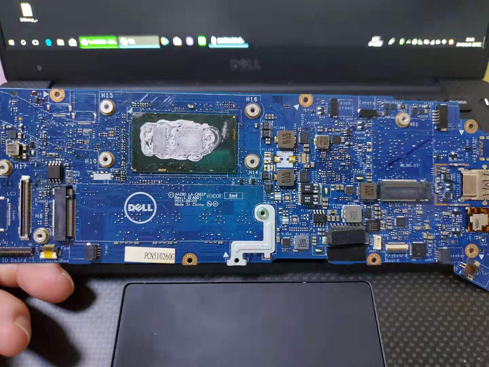
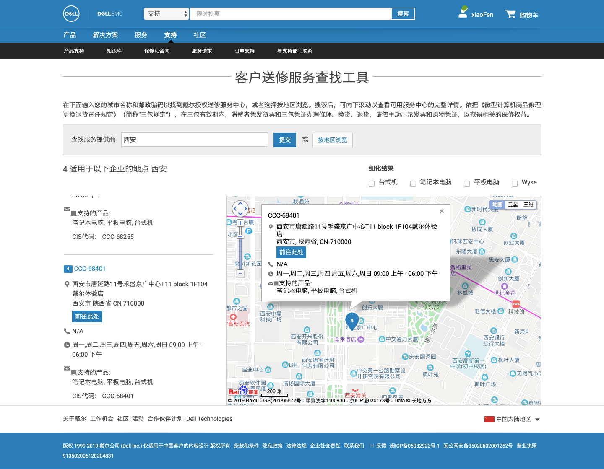
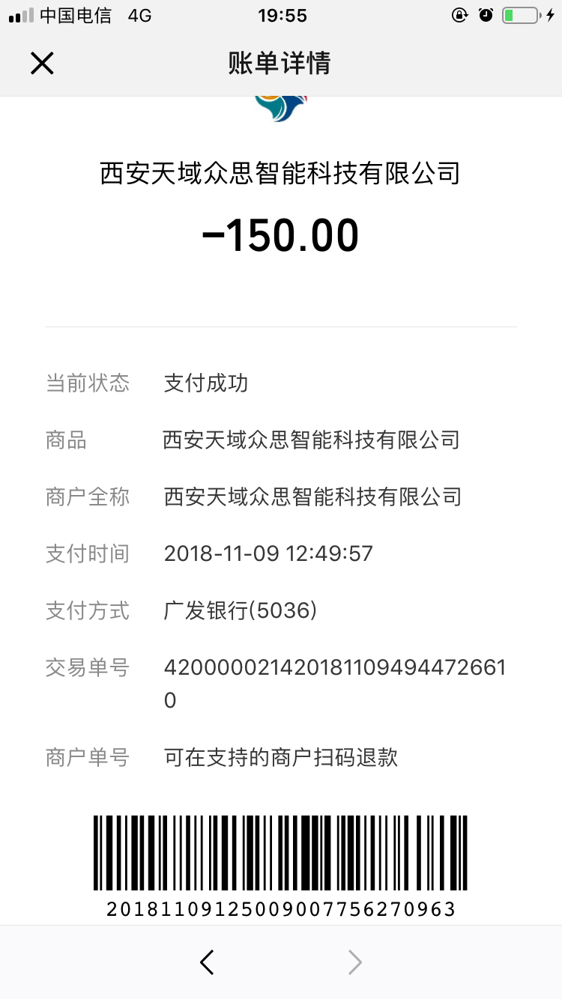
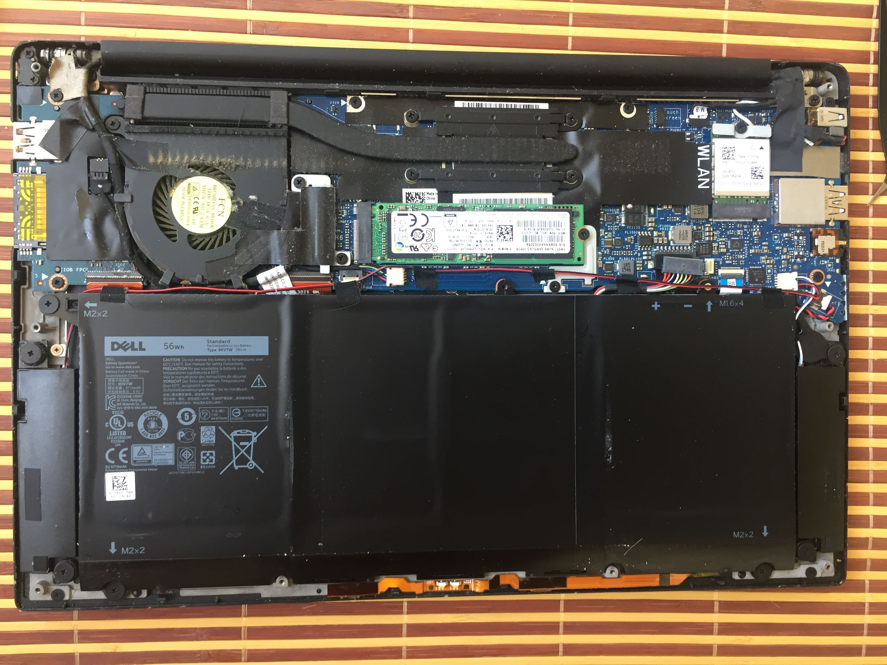
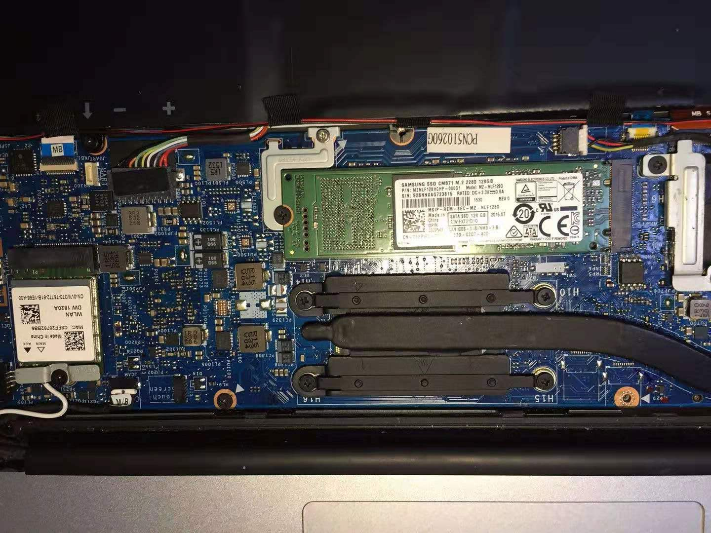
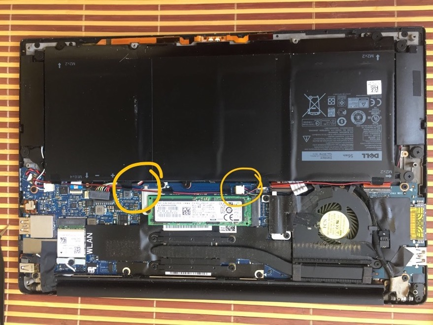
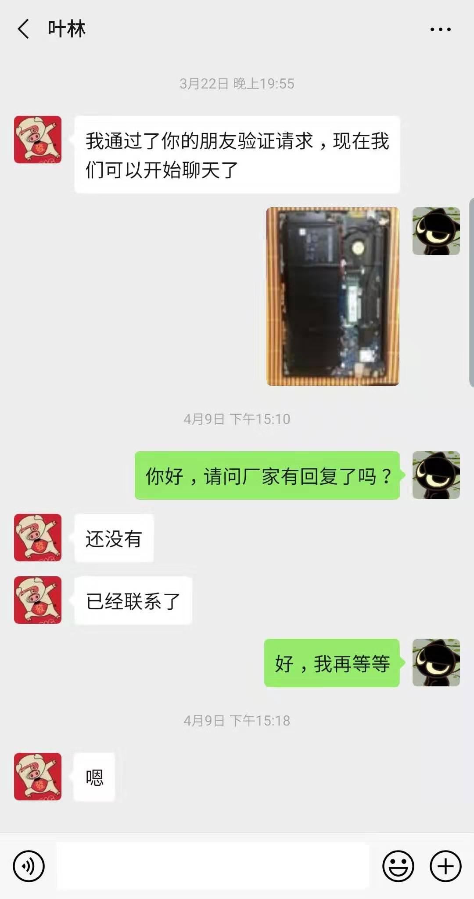

[tag]: dell,投诉

## 2019-10-09更新
9月25日我去赛格修好了这台电脑，换了新的主板和512的固态，一共花了`2800` + `510` = `3310`元。电脑能开机后，通过查看硬盘数据，该硬盘并不是我的，因此坐实了主板和硬盘在维修期间被dell售后更换这一行为，至少硬盘是被更换掉的。原失主的硬盘我会想办法及时退还。 

8月14日，我曾在dell官网社区反应了这一情况[[链接](https://www.dell.com/community/XPS-%E7%AC%94%E8%AE%B0%E6%9C%AC/%E6%8A%95%E8%AF%89%E8%A5%BF%E5%AE%89%E4%B8%80%E5%94%AE%E5%90%8E/td-p/7353967)]，通过与售后交流其表示会了解相应情况，后续有进展会回复我。直到现在，未得到进一步回复。  
后续有进展我会及时更新。

## 购机时间
16年春在京东自营购买的xps13六代i7，8g内存，256g版本。  

## 售后地点
18年世界杯期间键盘右上部分靠近电源处进水，自己主动打开后盖清了下水，还是无法开机。拿到售后查询刚过保，选择付费维修，维修地点在陕西省西安市雁塔区唐延路11号戴尔体验店，在官网售后可查到该店。  
  

## 维修时间
送去维修具体时间忘了，大概在9月前后。当时承诺15个工作日内给答复，但是等了1个月左右没有任何回复。我上门找到售后，告知我不能开机的原因是进水，可能要换主板，价格比较贵。我选择放弃维修，后来到11月9号这天才拿到机器，并且付了150元的拆机费，收款方为**西安天域众思智能科技有限公司**。  
  

有一个小插曲，取电脑那天有两台xps13，从C面看一个i5，一个i7，并且i7的后壳（D面）铭牌处不是我的机器编码，售后说壳子装反了，拿拆卸工具换了两台机器的后壳。

## 发现问题
后来我日常一直用的公司电脑，今年（19年）3月19日，偶然拆开，发现机器的硬盘不是原装的pm951，变成了cm871，而且主板与送修前有明显区别，部分电子元器件的颜色和编号有所不同。  

如下为原装硬盘和主板，拆机时间在送修前，大概18年7到8月份左右  

如下为维修后的硬盘和主板，拆机时间2019年3月19日前后  

上下图对比，可以明显看到，硬盘变成了128g的cm871, 有几处元器件的颜色也不一样  

## 联系售后
2019年3月22日，我再次找到售后说明了情况，售后表示会向厂家询问情况，但是后续没有答复，4月9日再次追问，直到现在（2019年8月14日），依旧没有明确答复。  

## 时间轴
18年7月电脑进水，随后我拆开进行了简单处理，9月拿到售后维修，11月拿回机器，19年3月发现硬盘非原装，主板与送修前的不一致，紧接着联系售后，直到今天，未得到售后答复，且从送修至今，售后从未主动联系过我。  

## 投诉
这件事经历了将近一整年时间，至今没有一个结果，平时工作忙也差点把这事忘了。等待了这么长时间，我决定投诉陕西省西安市雁塔区唐延路11号这家dell体验店，原因有二
- 主板和硬盘被擅自更换，损害了我作为消费者的切身利益；
- 无法有效沟通，不能解决我的售后问题。  

## 最后
我个人第一台电脑就是dell的，09年，D630，后来陪伴了我整个大学，期间拆了无数次清灰，又组装，很有感情☺️。大四实习时的第一份工作，分期买了xps13，没想到两年就夭折了，很伤心，更难受的是碰上这么不负责任的售后。  

事情到现在，我不要求戴尔任何赔偿和补偿，这台电脑等有空找个小店去修，但是仍然很希望戴尔给个说法，或者回复我一下。  

